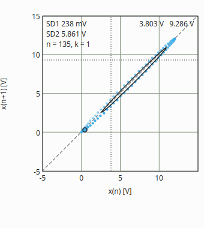

# Poincaré plot

The Poincaré plot shows how much a reading scatters. Every reading is a
point: its value x(n) to the right, the value of the next reading x(n+1)
upwards. A perfectly steady value is a single point on the dashed diagonal;
real readings make a cloud, and its shape says what kind of scatter it is:

- **Noise** - reading to reading jitter - widens the cloud *across* the
  diagonal.
- **Drift** - a slow change, warming up, a battery running down - stretches it
  *along* the diagonal.
- **Jumps** between two or more levels - a loose contact, a relay - make
  separate clusters next to the diagonal.

Switch it on with **Poincaré plot** in the toolbar or the menu (Ctrl+5); it
sits in the column next to the graph. It collects the main value while
QtDMM runs, shown or not, independent of the recorder.

## The numbers

The ellipse and the numbers in the top left corner put the shape into two
figures, in the unit of the reading:

- **SD1** - the spread across the diagonal, the short-term noise from one
  reading to the next.
- **SD2** - the spread along the diagonal, the long-term variation.

**n** is the number of points, **k** the distance of the pairs (below). The
newest point has a ring; older points fade, so you see where the value is
heading. Hovering shows the two values under the cursor.

## What counts

- The last **500** readings, in base units: a range change (mV to V) goes
  on, another function (V DC to Ω, °C to °F) starts afresh.
- No pair spans a gap: an overload (OL), a held display (HOLD) or a meter that
  stopped sending breaks the sequence.

## The context menu

Right-click into the plot:

- **Distance k** - pair each reading with the one 1, 2, 3, 5 or 10 readings
  later. With a larger distance slow changes show more clearly.
- **Points** - how many readings the plot keeps, 100 to 5000.
- **Ellipse SD1/SD2** - the ellipse on or off; the numbers stay.
- **Hold picture** - freezes what you see; the readings go on being
  collected, and the next update after releasing it shows them.
- **Clear** - starts afresh.
- **Save image...** - the plot as PNG or SVG.

Distance, points and the ellipse are kept with the other settings of this
instance.
